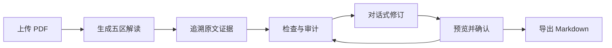

<div align="center">

# PaperLens

### 读懂论文，让每一句解读都有据可循。

基于腾讯混元 Hy3 的学术阅读与证据审计工作台<br>
从 PDF 到结构化解读，从原文核验到对话式修订，在一个界面完成。

[](pyproject.toml)
[](frontend/package.json)
[](frontend/package.json)
[](backend/app/main.py)
[](LICENSE)

[快速开始](#快速开始) · [功能亮点](#功能亮点) · [观看演示](reports/stage8_demo.webm) · [项目资料](#项目资料)

</div>

---

## 为深入阅读而设计

论文阅读不仅是提取摘要，还包括理解研究方法、核对关键结论，以及整理自己的表达。**PaperLens 将阅读、证据和修订放在同一个工作台**：一边查看 PDF 原文，一边阅读结构化解读，随时追溯句子的来源，再通过自然语言完成修改。

适合希望快速建立论文全貌的学生、需要核对论据的研究者，以及正在整理文献笔记的知识工作者。

## 功能亮点

| | 功能 | 你可以做什么 |
| :---: | --- | --- |
| 📄 | **五区结构化解读** | 按研究问题、研究方法、主要结果、研究局限与通俗解释组织论文内容 |
| 🔎 | **主张级证据追溯** | 从解读句子定位引用摘录与 PDF 页码，在阅读中核对依据 |
| 🧭 | **快速检查与完整审计** | 先查看证据检查，再进行八维完整审计与评分 |
| 💬 | **对话式修订** | 用自然语言提出句子或全文修改意图，先预览补丁，再确认应用 |
| 🕘 | **版本记录与回退** | 保留修改历史，比较阅读与修订过程中的不同版本 |
| 📤 | **Markdown 导出** | 将当前解读导出为便于整理、分享和继续编辑的文档 |

### 一条连贯的阅读流程



**原文、解读、操作并排呈现。** 在三栏工作台中，阅读与核验无需反复切换页面；修订由你确认，历史版本随时可回看。

> 🎬 [观看约 50 秒的工作台演示](reports/stage8_demo.webm) · 演示采用本地 API 与 Mock 预置示例。

## 快速开始

以下命令适用于 **Windows PowerShell**。准备 Python 3.13、Node.js 24 和 Git，在本地启动工作台。

### 1. 获取项目

```powershell
git clone https://github.com/DakerDack/PaperLens.git
Set-Location PaperLens
```

### 2. 安装依赖

```powershell
py -3.13 -m venv .venv313
& '.\.venv313\Scripts\python.exe' -m pip install -r requirements.lock
& '.\.venv313\Scripts\python.exe' -m pip check

if (-not (Test-Path -LiteralPath '.env')) {
    Copy-Item -LiteralPath '.env.example' -Destination '.env'
}

Push-Location frontend
npm.cmd ci
Pop-Location
```

### 3. 启动示例工作台

在仓库根目录打开第一个终端，启动后端。此配置使用 **Mock 预置结果**与 pdfplumber 文本解析，适合体验仓库自带示例。

```powershell
$env:PAPERLENS_MODEL_MODE = 'mock'
$env:PAPERLENS_DATA_DIR = './data/demo'
$env:MINERU_COMMAND = './.venv-mineru-disabled/Scripts/mineru.exe'

& '.\.venv313\Scripts\python.exe' -m uvicorn backend.app.main:app --host 127.0.0.1 --port 8000
```

在仓库根目录打开第二个终端，启动前端：

```powershell
Set-Location frontend
npm.cmd run dev -- --host 127.0.0.1 --port 5173 --strictPort
```

| 入口 | 地址 |
| --- | --- |
| 阅读工作台 | http://127.0.0.1:5173 |
| 交互式 API 文档 | http://127.0.0.1:8000/api/docs |

### 4. 体验完整流程

1. 上传 [`simple_2page.pdf`](backend/tests/fixtures/simple_2page.pdf)，确认处理权限。
2. 生成五区解读，查看快速检查与完整审计。
3. 点击解读句子，查看对应页码和引用摘录。
4. 输入示例修改意图 **“只追加安全标点”**，预览并接受修订。
5. 重新审计、查看历史版本，导出 Markdown。

两个终端分别按 `Ctrl+C` 即可停止服务；项目数据保存在 `PAPERLENS_DATA_DIR` 指定的本地目录。

## 连接 Hy3

**Live 模式**通过腾讯云 TokenHub 调用 Hy3，用于真实模型生成、审计与修订。在本机 `.env` 中配置：

```dotenv
PAPERLENS_MODEL_MODE=live
HY3_API_KEY=your_tokenhub_api_key
```

在新的后端终端中，从仓库根目录启动：

```powershell
& '.\.venv313\Scripts\python.exe' -m uvicorn backend.app.main:app --host 127.0.0.1 --port 8000
```

若沿用示例终端，先执行 `Remove-Item Env:PAPERLENS_MODEL_MODE -ErrorAction SilentlyContinue`，让模式配置从 `.env` 加载。页面中的模式标识可用于确认当前运行方式。

Live 请求会将相关来源内容、解读和修订上下文发送至模型服务。请使用有权处理的材料，并将 API Key 保留在本机 `.env` 中。模型调用费用按服务商计费规则结算。

## 设计与技术

PaperLens 将语言理解与可核验的工程环节分开组织：**Hy3 负责生成与语义分析，代码负责引文核验、页码关联及评分计算**。

| 层次 | 技术与职责 |
| --- | --- |
| 交互界面 | React 19、TypeScript、Vite，组织阅读、审计与修订流程 |
| PDF 阅读 | PDF.js，呈现原文、页码跳转与文本查找 |
| 服务端 | FastAPI、Pydantic，提供接口与结构化数据契约 |
| 文档解析 | pdfplumber 文本解析；可通过独立 CLI 接入 MinerU |
| 模型服务 | Hy3，经 TokenHub 完成生成、语义审计与修订 |
| 证据处理 | 引文匹配、BM25 检索及确定性核验 |
| 项目存储 | 本地文件与 SQLite，记录项目内容及版本历史 |
| 工程验证 | pytest、Vitest、Playwright |

<details>
<summary><strong>开发者：运行检查</strong></summary>

在仓库根目录运行后端与评测测试：

```powershell
& '.\.venv313\Scripts\python.exe' -m pytest backend/tests eval/test_eval.py -q -p no:cacheprovider
```

前端检查与构建：

```powershell
Set-Location frontend
npx.cmd --no-install playwright install chromium
npm.cmd run test -- --run
npm.cmd run typecheck
npm.cmd run build
npx.cmd --no-install playwright test
```

应用 Python 依赖由 `requirements.lock` 固定，前端依赖通过 `package-lock.json` 与 `npm ci` 安装。MinerU 使用独立工具环境，通过 `MINERU_COMMAND` 指定 CLI 路径。

</details>

## 项目资料

本项目参与“开放式场景：AI 应用与评判标准设计”，配套提供场景分析、评测材料和可追溯的实验记录。

| 资料 | 内容 |
| --- | --- |
| [任务一分析报告](docs/task1_analysis.md) | 应用场景、八维评价标准、实验设计与分析 |
| [项目设计](docs/paperlens_project_proposal.md) | 产品目标与工作流设计 |
| [开发计划](docs/DEV_PLAN.md) | 实现任务、版本演进与验证记录 |
| [评测样本](eval/live_cases.json) | 公开材料与样本清单 |
| [评测结果](reports/stage7_full_results_auditv8_scope_r1.md) | 逐项结果与记录索引 |
| [评测工具](eval/run_eval.py) · [报告工具](eval/build_report.py) | 评测执行与报告重建 |

## 开源与致谢

PaperLens 的自有代码采用 **[MIT License](LICENSE)**，欢迎学习、使用和参与改进。

感谢腾讯混元 Hy3 及开源社区提供的模型与工具支持。第三方组件和材料归属见 [第三方说明](docs/THIRD_PARTY_NOTICES.md)。本项目为个人开源项目。

---

<div align="center">

**PaperLens · 从阅读到理解，从结论到证据。**

如果这个项目对你有帮助，欢迎点亮一颗 ⭐

</div>
