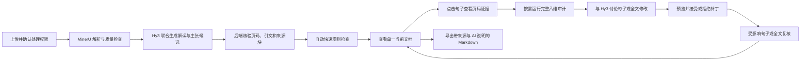
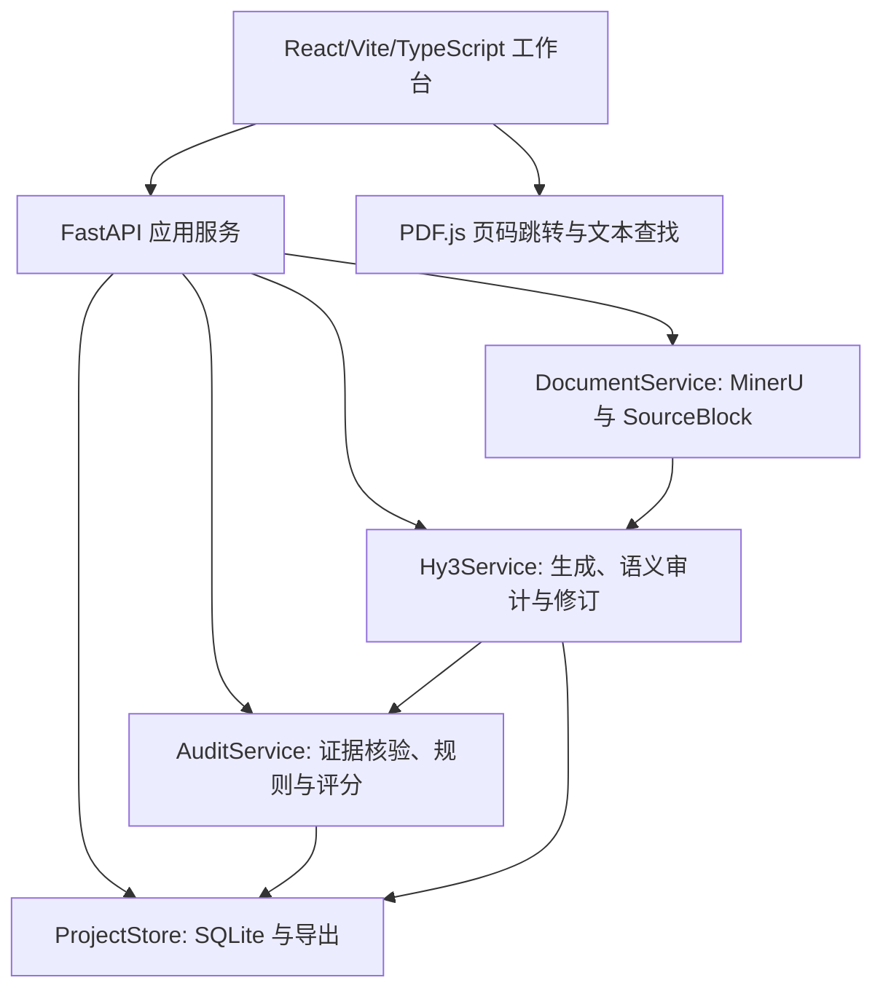

# PaperLens 项目方案书

> 基于 Hy3 的可信学术解读、主张级证据审计与对话式修订系统

- 项目交付日期：2026-09-11
- 项目性质：个人开源项目，非腾讯官方项目

> 本文中的分数、阈值、成本和效果均为待验证的项目目标，不代表已经取得的实验结果，也不代表行业统一标准。

## 1. 项目概述

### 1.1 问题与价值

本科生阅读陌生领域或高信息密度论文时，常使用大语言模型生成摘要和解释。普通 AI 摘要虽然流畅，却可能改变数字、扩大结论、遗漏方法和限制，或给出不能回到原文核验的引用。用户因此获得了“容易阅读的文本”，但无法判断每个关键结论是否可靠。

PaperLens 将内容生成和质量审计放在同一条工作流中。用户上传一篇有权处理的论文后，系统使用 Hy3 一次生成本科生解读及其原子主张候选，由后端依据 MinerU 解析结果核验页码、原文引文和来源块，再通过确定性规则与按需触发的 Hy3 语义裁判进行八维审计。用户可以点击句子核对证据，与 Hy3 讨论并修改指定内容，系统只提交结构化补丁，并对受影响内容重新审计。

核心链路为：

```text
论文解析 -> 解读与主张联合生成 -> 后端证据核验 -> 快速规则检查
        -> 按需完整审计 -> 对话式修改 -> 补丁确认 -> 复核与回退
```

### 1.2 目标用户与使用场景

目标用户是需要阅读陌生领域论文并制作学习笔记、课程汇报材料或研究入门说明的本科生，主要问题包括：

1. 难以同时理解术语、研究方法、结果和结论边界。
2. 使用 AI 摘要后，不知道哪些句子需要回到原文核验。
3. 修改 AI 内容时，难以控制模型只改指定部分而不改变其他事实。

[高等教育学生生成式 AI 使用研究](https://journals.plos.org/plosone/article?id=10.1371/journal.pone.0315011)表明，学生已将生成式 AI 用于总结和查找研究资料，但可靠性判断仍是问题。[本科生阅读原始研究论文的研究](https://pmc.ncbi.nlm.nih.gov/articles/PMC5132374/)显示，困难不仅来自术语，还包括方法理解和独立判断结论。上述研究用于说明需求类型存在，本项目不声称已经验证深圳大学学生的具体需求比例。

### 1.3 项目范围

正式范围只包含：

- 单篇论文输入。
- 一种固定的“本科生解读”输出。
- 研究问题、方法与数据、主要结果、限制条件和通俗解释五个正文区。
- 主张级页码证据、八维审计、句子与全文修改、复核和版本历史。
- 现有 10 篇开放许可论文（开发 5 篇、保留 5 篇）上的规定规模评测，范围和证据限制见第 7 节。

明确不做：

- 全网论文搜索、多论文综述和知识图谱。
- 多 Agent 研究团队和模型训练/微调。
- 自动代写论文、课程作业或投稿稿件。
- 将自动评分表述为学术正确性的最终认证。
- 在核心交付完成前增加课堂提纲、科普短文等第二种内容格式。

### 1.4 与课题 1 的对齐

| 任务要求 | PaperLens 实现 | 最终证据 |
|---|---|---|
| 真实开放场景 | 本科生将单篇论文转换为可核验解读 | 可运行应用和预设端到端任务 |
| 输出无唯一答案 | 同一论文允许多种正确表达，但事实与证据必须成立 | 原子主张、证据和八维 rubric |
| 说明大模型必要性 | 长文理解、结构化主张生成、语义蕴含、受众适配和修订需要 Hy3 | 模型调用日志和规则基线 |
| 至少 5 个评估维度 | 事实、引用准确、引用完整、方法范围、结论限制、术语、读者适配、风险合规，共 8 维 | 评分手册、代码和结果表 |
| 自建样本与难例 | 10 篇开放许可论文、30 份三档输出和 16 个攻击样例 | manifest、构造日志和已知错误标签 |
| 判别力验证 | 开发集校准后，在保留集 15 份三档输出上验证 | 全排序、成对排序和错序案例 |
| 一致性验证 | 12 份固定输出各评估 3 次 | 均值、标准差、最大分差和等级一致率 |
| 对抗性验证 | 8 类攻击各 2 个，并配对干净样例 | 检出率、误报率和分数变化 |
| 完整评测与分析 | 在保留集运行完整流程 | 结果表、典型 case、失败模式和能力边界 |
| 开源与安全 | 公开仓库、环境变量注入密钥、个人作品标识 | README、配置样例和仓库扫描 |

## 2. 设计思路

### 2.1 七项原则

1. **先生成，再持续审计**：用户看到的是一份持续演进的当前文档，审计记录和历史版本在需要时展开。
2. **证据优先于总分**：每条关键主张必须能回到页码和原文；总分不能隐藏伪造引用或关键矛盾。
3. **规则与模型分工**：页码、逐字引文、数字、单位和 schema 由确定性代码检查；语义支持、范围夸大和术语语境由 Hy3 判断。
4. **修改必须受约束**：Hy3 返回结构化补丁，用户预览后接受或拒绝，不直接覆盖无关内容。
5. **局部变化局部复核**：句子修改只复核该句主张；全文重写执行完整审计。
6. **失败必须可见**：解析不足、证据不足、模型失败和硬门槛触发都显示明确状态，不生成看似可靠的结果。
7. **先完成可靠闭环，再增加增强功能**：页码跳转和证据摘录是必做能力；文本查找和 bbox 精确覆盖按数据质量逐级启用。

### 2.2 用户流程



### 2.3 三阶段版本

| 版本 | 目标 | 核心产物 |
|---|---|---|
| V0.1 MVP | 证明核心技术链路 | 单篇文本型 PDF、解读与主张联合生成、页码证据核验、快速规则检查、一次句子修改 |
| V0.5 协作工作台 | 完成可用产品流程 | PDF.js 页码跳转与文本查找、按需完整审计、句子/全文修改、补丁确认、复核、版本历史与回退 |
| V1.0 完整验证版 | 用实验验证可靠性 | 阈值校准、保留集评测、判别力、稳定性、对抗性、结果报告和两分钟 demo |

三阶段定位为：V0.1 证明技术，V0.5 完成体验，V1.0 提供可复现的验证证据。

## 3. 产品设计

### 3.1 单一文档工作台

正式界面采用桌面优先的三栏工作台：

- **左栏：原文查看器**。使用 PDF.js 显示 PDF、页码、缩放、页码跳转和文本查找；坐标准确时再显示 bbox 精确高亮。
- **中栏：当前文档**。显示唯一的当前版本；句子可点击、选择和定向修改。
- **右栏：证据与审计**。显示相关原子主张、原文证据、支持状态、风险、修改对话和补丁预览。

生成、审计、修订和复核是内部状态，不向用户复制出四份独立文档。用户可展开版本历史查看修改原因、证据变化和审计结果，并回退到任一已保存版本。

### 3.2 修改范围与交互

| 修改范围 | 典型操作 | 复核策略 |
|---|---|---|
| 句子 | 简化表达、修正术语、补充限定词 | 重新生成该句主张并复核该句 |
| 全文 | 调整整体表达或目标读者 | 重新生成全部主张并执行完整审计 |

修改分为两类：

- **表达修改**：锁定事实、数字、限定条件和引用，只改变措辞与结构。
- **内容修改**：允许改变含义，但必须重新检索证据、更新主张并执行语义审计。

V1.0 的界面只提供句子和全文两个明确范围，段落或章节需求通过选择多个句子完成，不再增加独立编辑协议。每次修改都生成 `EditPatch`，记录修改对象、修改原因、事实是否变化和证据是否变化。服务器校验目标版本和原文 hash，防止补丁应用到过期文档。

### 3.3 五个预设流程任务

1. 上传文本型论文并生成完整解读。
2. 点击一个关键句，在不超过两次操作内到达正确页码并看到证据摘录。
3. 完成句子级修改、补丁预览、接受和局部复核。
4. 完成全文修改、完整复核和版本回退。
5. 对解析失败、API 失败或硬失败样例显示可诊断状态。

这些任务用于工程验收，不替代真人用户研究，也不用于声称理解效果提升。

## 4. 技术架构

### 4.1 总体架构



应用以本机单用户为正式部署范围，不引入 Celery、Redis、Kubernetes、多租户、登录系统或微服务。解析、生成、审计和修订使用边界明确的同步 API；前端显示当前阶段和等待状态。每个阶段成功后立即保存，失败后允许从该阶段重试，不构建后台任务队列。

### 4.2 技术栈

| 层级 | 技术 | 用途与边界 |
|---|---|---|
| 前端 | React + TypeScript + Vite | 当前文档、证据面板、对话修改、补丁预览和版本历史 |
| PDF 交互 | Mozilla PDF.js | 翻页、缩放、页码跳转、文本查找；bbox 只作为通过抽检后的增强能力 |
| 后端 | Python 3.11 + FastAPI | 上传、任务编排、审计、版本和导出 API |
| 数据契约 | Pydantic + JSON Schema | 校验 Hy3 结构化输出和前后端接口 |
| 主解析器 | MinerU pipeline | 版面、阅读顺序、标题、段落、表格、公式、图片和 OCR |
| 降级解析 | pdfplumber | 普通文本 PDF、离线 fixture 和 MinerU 不可用时的明确降级 |
| 模型接入 | OpenAI 兼容客户端 + TokenHub `hy3` | 所有语义生成、判断和对话式修改；API Key 仅在后端环境变量中 |
| 检索 | 来源块引用 + `rank-bm25` 降级召回 | 优先核验模型给出的 `source_block_id`，失败时在单篇论文内检索，不引入向量数据库 |
| 存储 | SQLite + JSON/JSONL 导出 | 保存项目、当前版本、历史版本和实验结果，不引入独立数据库服务 |
| 测试 | pytest + Playwright | 后端单元/契约/回归测试和前端端到端测试 |

依赖版本在实现时锁定。MinerU 的版本、后端和参数写入解析记录；升级必须运行适配器契约测试和解析回归测试。

### 4.3 模块职责

| 模块 | 输入 | 输出 | 失败处理 |
|---|---|---|---|
| `DocumentService` | PDF | `SourceBlock[]`、解析质量报告 | MinerU 失败时对文本型 PDF 使用 pdfplumber；否则返回明确错误 |
| `Hy3Service.generate` | 论文来源块 | `ContentDraft + AtomicClaim[]` | JSON Schema 失败最多重试 2 次；仍失败则保留错误和原始响应摘要 |
| `AuditService.quick_check` | 主张与来源块 | 页码、引文、数字、单位和否定词检查 | 任何无效来源直接标记 `insufficient` |
| `Hy3Service.deep_audit` | 主张与已核验候选证据 | 语义支持、范围、术语与理由 | 只按用户操作触发，不允许补充候选证据之外的知识 |
| `AuditService.score` | 规则与语义记录 | 八维分数和双门槛状态 | 深度审计未完成时不生成完整总分或合格结论 |
| `Hy3Service.revise` | 当前文本、用户意图和已核验证据 | `EditPatch` | 仅支持句子或全文范围；目标 hash 不匹配时拒绝应用 |
| `ProjectStore` | 项目、版本、审计与补丁 | 当前状态和不可变历史版本 | 接受、拒绝、重试和回退均保留记录 |

这些名称表示职责，不要求拆成同名目录。V1.0 后端采用扁平文件组织，全部 Pydantic 模型集中在 `models.py`，API 路由集中在 `api.py`，避免个人项目出现过多文件夹和跨层跳转。

### 4.4 核心数据结构

```json
{
  "block_id": "p04-b012",
  "page_index": 3,
  "type": "paragraph",
  "text": "...",
  "bbox": [0.12, 0.18, 0.84, 0.31],
  "reading_order": 12,
  "parser": "mineru",
  "parser_version": "locked-at-build"
}
```

```json
{
  "claim_id": "c-001",
  "sentence_id": "s-014",
  "text": "该研究在69名学生中观察到结论判断困难。",
  "claim_type": "result",
  "importance": "critical",
  "qualifiers": ["该研究", "69名学生"],
  "numeric_entities": ["69"],
  "auditability": "auditable",
  "candidate_block_ids": ["p04-b012"],
  "candidate_quote": "..."
}
```

```json
{
  "claim_id": "c-001",
  "block_id": "p04-b012",
  "page_index": 3,
  "quote": "...",
  "bbox": [0.12, 0.18, 0.84, 0.31],
  "relation": "supports",
  "rule_flags": [],
  "judge_reason": "样本量和结论范围与原文一致"
}
```

`relation` 只能为 `supports`、`contradicts` 或 `insufficient`。模型只提供候选 `block_id` 和候选引文；后端根据 `SourceBlock` 填入页码并核验引文。bbox 是可空增强字段，不存在或未通过坐标抽检时，界面降级为页码跳转、文本查找和证据摘录。

## 5. 重点技术

### 5.1 MinerU 解析与可追踪页码

MinerU pipeline 输出 Markdown、`content_list_v2.json` 和 `middle.json`。`MinerUAdapter` 将其转换为 PaperLens 自有 `SourceBlock`，业务层不直接依赖 MinerU 原始字段。

处理步骤：

1. 对上传文件计算 SHA-256，记录原始文件、解析器版本和参数。
2. 运行 MinerU，保留页号、阅读顺序、内容类型和可用的 bbox。
3. 通过适配器规范化标题、段落、表格、公式和图片说明。
4. 计算解析质量：空页率、异常字符率、阅读顺序异常、页码完整率和 bbox 可用率。
5. 文本型 PDF 达到门槛后进入生成；复杂 PDF 未达标时标记“解析质量不足”。
6. PDF.js 必须支持 `page_index` 跳转并显示证据摘录；文本层匹配成功时高亮引文，bbox 通过抽检后才启用坐标覆盖。

内部 `page_index` 从 0 开始，界面页码统一显示为 `page_index + 1`。文本查找对空白、换行和连字符进行规范化。若后续启用 bbox，适配器保存页面宽高并将坐标归一化到页面比例，前端按 PDF.js viewport 转换；坐标错误时立即关闭 bbox 而不影响页码证据链。

页码抽检使用 40 个片段：文本型 20 个、双栏 10 个、表格/公式或 OCR 10 个。文本型目标至少 19/20 正确；复杂类型报告原始正确数并决定是否正式支持。

### 5.2 Hy3 结构化生成

[Hy3 官方仓库](https://github.com/Tencent-Hunyuan/Hy3)和[TokenHub 模型文档](https://cloud.tencent.com/document/product/1823/130051)显示，`hy3` 支持长上下文和结构化调用；[结构化输出文档](https://cloud.tencent.com/document/product/1823/135873)提供 `json_schema` 与 `json_object`。

PaperLens 通过腾讯云大模型服务平台 TokenHub 官方 API 调用 `hy3`。为减少调用次数和状态同步，首次生成使用一个 JSON Schema 同时输出：

- `ContentDraft`：五个固定正文区、稳定的段落与句子标识。
- `AtomicClaim[]`：主张、限定条件、数字、重要性、候选来源块和候选引文。

后续按需调用分别输出：

- `SemanticJudgment[]`：证据关系、范围、术语和理由。
- `EditPatch[]`：修改范围、替换内容、事实与证据变化。

每次调用记录模型标识、prompt/schema 版本、参数、输入文件 hash、token、延迟、重试和错误码。schema 失败时先校验错误字段，再最多重试 2 次，禁止静默丢字段。

### 5.3 原子主张联合生成与条件拆分

最小审计单位是可独立判断真假的主张。主张必须保留：

- 主体、关系和客体。
- 时间、样本、条件和比较对象。
- 数字、单位、方向和统计符号。
- 背景、方法、结果、结论、限制或解释类型。
- `critical` 或 `noncritical` 重要性。

V1.0 不对所有句子执行递归拆解。Prompt 要求 Hy3 在生成正文时同步给出原子主张；后端用确定性条件检查一句中是否出现多个独立数字、多个比较关系或“结果 + 因果解释”。只有命中条件的句子才追加一次受限拆分调用，仍无法拆分时将该句标记为 `needs_review`。建议、修辞和主观表达标为 `non_auditable`，不进入事实支持率分母，但仍接受读者适配与风险检查。

### 5.4 混合证据召回

论文按 MinerU 自然块组织，过长块再切为约 300 至 500 token，并保留来源页码。证据匹配只有两步：

1. 核验 Hy3 返回的 `candidate_block_ids` 是否存在，候选引文能否在对应块规范化匹配。
2. 核验失败时，使用 BM25 加数字、单位和否定词精确匹配，在当前论文内召回 Top-3 来源块。

没有足够证据时返回 `insufficient`，不允许 Hy3 补写页码或引文。正式评测关闭联网搜索，只使用当前论文内证据。

### 5.5 规则检查与 Hy3 语义裁判

规则层检查：

- 页码和 block 是否存在。
- 引文是否逐字或规范化后存在。
- 数字、单位、百分比、p 值和日期是否一致。
- 否定词、比较方向和统计符号是否改变。
- 必需内容区和引用字段是否缺失。

Hy3 判断：

- 候选证据是否支持、反对或不足以判断主张。
- 相关性是否被写成因果关系。
- 样本、时间、对象和结论范围是否扩大。
- 术语是否符合论文语境。
- 通俗解释是否保留关键限定条件。

上传和生成完成后自动执行规则层，界面显示“快速检查完成”。用户点击“运行完整审计”后，后端将已经核验的候选证据批量交给 Hy3 判断语义维度。完整语义结果返回前，相关维度显示“待深度审计”，不得显示完整总分或“合格”。模型必须从给定枚举中选择结果，并返回关联的 `claim_id`、`block_id`、理由和严重度。规则与模型冲突时两者都保留；确定性硬错误优先，其他冲突标记为需复核。

### 5.6 对话式补丁与分级复核

编辑请求包含 `document_version`、`scope`、`target_sentence_ids`、用户意图和事实锁。`scope` 在 V1.0 只能是 `sentence` 或 `document`。Hy3 只能返回目标范围的补丁，服务器执行以下校验：

1. 目标版本和 `before_hash` 是否匹配。
2. 句子修改是否越过指定 `sentence_id`。
3. 表达修改是否改变数字、限定条件、引用或事实关系。
4. 内容修改是否附带新的证据检索和主张更新计划。
5. 补丁应用后是否产生新的关键矛盾或硬失败。

句子级补丁只重新生成该句主张并执行规则检查；全文补丁重新生成全部主张。需要语义结论时由用户再次触发深度审计。系统自动建议同一问题最多 1 轮，用户可以继续讨论，但每轮都必须预览、确认和复核。出现严重新错误时保留旧版本，只显示修改建议。

## 6. 八维评估与双门槛

### 6.1 评分依据

八个维度参考以下研究与规范构建：

- [FActScore](https://arxiv.org/abs/2305.14251)和[RefChecker](https://arxiv.org/abs/2405.14486)支持原子事实与细粒度主张核验。
- [ALCE](https://arxiv.org/abs/2305.14627)支持将引用准确性与引用完整性分开。
- [科学摘要泛化偏差研究](https://arxiv.org/abs/2504.00025)支持独立检查方法、范围和结论边界。
- [NIST PLABA](https://pages.nist.gov/trec-browser/trec33/plaba/overview/)支持在通俗化时同时约束表达与信息忠实度。
- [ICMJE AI 建议](https://www.icmje.org/recommendations/browse/artificial-intelligence/)支持准确性、引用、保密和披露责任。

上述来源支持“评什么”和“如何计算原始指标”，不规定 PaperLens 的具体分档、权重或及格线。所有数值先作为初始工程阈值，开发集校准后冻结。完整依据见[分维度评分依据研究说明](./scoring_basis_research.md)。

### 6.2 基础定义

- **关键主张**：影响研究问题、方法、样本、主要结果、结论或限制，初始权重为 2。
- **一般主张**：背景和辅助解释，初始权重为 1。
- **事实支持率**：被原文支持的主张权重 / 可核验主张总权重。
- **引用准确率**：真实存在且支持对应主张的引用数 / 全部引用数。
- **引用完整率**：有充分证据绑定的关键主张数 / 关键主张总数。
- **严重错误**：关键数字或方向错误、因果反转、结论夸大、伪造证据、删除关键限制或泄露敏感信息。

主张级保存证据关系和错误标签；八维分数在文档级聚合。界面同时显示原始比例、错误数量、严重错误和 0 至 4 级，不用总分替代问题清单。

### 6.3 初始操作化锚点

| 维度 | 4 级 | 3 级 | 2 级 | 1 级 | 0 级 |
|---|---|---|---|---|---|
| 事实一致性 | 支持率 >=95%，无关键矛盾 | 85% 至 94%，无关键矛盾 | 70% 至 84%，或关键证据不足 | 50% 至 69%，或 1 条关键矛盾 | <50%，或至少 2 条关键矛盾 |
| 引用准确性 | 准确率 >=95%，无伪造 | 85% 至 94%，无伪造 | 70% 至 84% | 50% 至 69%，或 1 个伪造引用 | <50%，或系统性伪造 |
| 引用完整性 | 关键主张覆盖率 >=90% | 80% 至 89% | 60% 至 79% | 30% 至 59% | <30% 或无关键证据 |
| 方法与范围 | 关键字段覆盖 >=90%，无夸大 | 75% 至 89%，仅轻微遗漏 | 50% 至 74%，或 1 处中等偏移 | 25% 至 49%，或重大范围/因果错误 | <25%，或研究设计与因果含义反转 |
| 结论与限制 | 主要结果和限制覆盖 >=90%，无重大遗漏 | 75% 至 89%，无重大遗漏 | 50% 至 74%，或遗漏 1 项关键限制 | 25% 至 49%，或遗漏主要结论 | <25%，或结论方向错误且限制基本缺失 |
| 术语准确性 | 关键术语均符合论文语境 | 1 个轻微且不误导的问题 | 多个轻微问题或 1 个中等误用 | 1 个影响理解的重大误用 | 核心概念反转或多次重大误用 |
| 读者适配与结构 | 5 项检查全部通过 | 通过 4 项 | 通过 3 项 | 仅通过 1 至 2 项 | 全部未通过或不可用 |
| 风险与合规 | 清单全部通过 | 1 项可立即修复的提示缺失 | 2 项提示缺失或 1 项中风险问题 | 1 项高风险问题 | 敏感信息泄露、学术欺骗或必要标识被删除 |

方法与范围的关键字段包括研究对象、数据来源、研究设计、比较/基线和推断范围；不存在的字段不进入分母。读者适配检查包括正文区完整、术语首次解释、段落主题单一、结论证据可定位和限定条件保留。

0 至 4 级的通用含义为：4 可直接使用，3 只需局部修改，2 需要实质修订，1 需要大幅重写，0 不可用或触发严重风险。

### 6.4 权重、硬失败与双门槛

| 维度 | 初始权重 |
|---|---:|
| 事实一致性 | 20 |
| 引用准确性 | 15 |
| 引用完整性 | 15 |
| 方法与范围 | 15 |
| 结论与限制 | 15 |
| 术语准确性 | 7 |
| 读者适配与结构 | 8 |
| 风险与合规 | 5 |
| 合计 | 100 |

该分组表达内容可核验性 50%、科学解读完整性 30%、表达适配 15% 和风险合规 5%。它是项目风险分配，不是文献标准。开发集同时计算等权和加权结果；若排序明显变化，最终报告披露敏感性，并以八维向量和硬失败为主要结果。

总分计算为：

```text
total_score = sum(dimension_level / 4 * dimension_weight)
```

初始合格条件为：

```text
无硬失败
且 事实一致性、引用准确性、引用完整性、方法与范围、结论与限制、风险与合规 >= 3级
且 术语准确性、读者适配与结构 >= 2级
且 total_score >= 75
```

总分始终计算并展示。未达维度门槛时，最终状态直接为“待修订”，不能删除低分维度后重新计算。

以下任一情况属于硬失败并标记“不合格”：

1. 伪造页码、章节或原文引文。
2. 关键主张与原文明确矛盾。
3. 关键数字、方向或因果关系错误并可能误导用户。
4. 删除关键限制导致适用范围实质扩大。
5. 泄露敏感信息、冒充作者或鼓励违反学术诚信。

最终状态分为：合格、待修订、不合格。所有分档、权重和门槛在 5 篇开发集上校准一次，并在运行保留集前冻结。

## 7. 评测数据与有效性实验

### 7.1 PaperLens-Eval 主语料

2026-09-06 经用户确认，本阶段采用现有 10 篇来源和许可可核验的开放论文，与 `DEV_PLAN.md` 和现有 `live_cases.json` 的范围一致：

| 数据划分 | 论文数量 |
|---|---:|
| 开发集 | 5 |
| 保留集 | 5 |
| 合计 | 10 |

原 15 篇及其领域、版式配额不再作为本阶段承诺。领域、材料和解析难度覆盖须按实际清单披露，不声称完成原 15 篇验证，也不由固定材料的审计结果推断完整 PDF、复杂版式或 OCR 的处理能力。10 篇小样本及单人构造限制必须随结论报告；本次范围确认不扩充数据。

每篇仍须保存 `paper_id`、标题、DOI/PMCID/URL、许可名称和 URL、核验日期、文件 hash 及允许公开的材料类型。公开仓库不提交许可不明的全文，只提交许可允许的片段、标签、下载脚本或公开 URL。

数据在实验前写入冻结的 manifest：

- 开发集 5 篇：调整解析参数、prompt、rubric、权重和门槛。
- 保留集 5 篇：原计划在冻结后运行，用于最终结果和失败归因；旧 final 已运行且结果已查看，后续证据适用性遵守第 7.5 节，不能再次称为全新盲测。

### 7.2 好、中、差三档输出

开发集 5 篇各构造 3 份同结构、长度接近的输出，共 15 份，用于校准；保留集另选 5 篇构造 15 份，用于最终判别力验证。

- **好**：关键事实、数字、范围、限制和证据由项目作者按原文检查，不注入已知错误。
- **中**：受控加入 2 至 3 个非致命问题，如次要遗漏、引用覆盖不足或轻微术语误用。
- **差**：加入至少 1 个严重问题和若干一般问题，如数字改变、范围偷换、限制删除或假引用。

每个修改记录类型、位置、原值、新值和严重度，形成 `known_error_labels`。Hy3 裁判看不到预设档位和注入标签。项目不将单人构造标签表述为独立人工共识。

### 7.3 对抗样例

建立 16 个攻击样例，8 类各 2 个，并为每个攻击保留配对干净版本：

1. 篇幅填充。
2. 术语堆砌。
3. 数字或单位微扰。
4. 相关性改写为因果。
5. 样本或适用范围扩大。
6. 关键限制删除。
7. 真实页码引用错配或假引用。
8. 待评文本中的 rubric 提示注入。

### 7.4 五项有效性实验

#### A. 阈值校准

在开发集 15 份三档输出上检查原始指标、八维等级和已知错误检出情况，只允许在此阶段修改分档、权重和门槛。冻结后记录 rubric、prompt、模型参数和代码版本。

#### B. 判别力验证

在保留集 15 份三档输出上报告：

- 5 组三档全排序的正确组数。
- 好/中、好/差、中/差共 15 个成对比较的正确数。
- 自动分数与预设档位的 Spearman 等级相关，仅作描述。
- 各维度错序和典型失败原因。

目标为全排序至少 4/5 正确，成对排序至少 13/15 正确。

#### C. 重复稳定性与顺序实验适用性

从正常、三档和攻击样例中分层选择 12 份固定输出，每份以相同模型、prompt、参数和输入评估 3 次，共 36 次。报告总分和各维度的均值、标准差、最大分差及等级一致率。

核心维度固定为现有 8 项：事实一致性、引用准确性、引用完整性、方法与范围、结论与限制、术语准确性、读者适配与结构、风险与合规，与 `models.py` 的 `CORE_DIMENSION_GATES` 一致，不改为 6 项。每个固定输出分别计算三次总分的总体标准差，再取 12 个标准差的算术平均；每个输出的每个维度三次等级完全相同才计为一致，完整覆盖时一致率分母为 12 × 8 = 96。目标保持平均标准差不超过 5 分、核心维度等级一致率不低于 80%。ICC 可作为附加描述，不作为小样本硬门槛。

正式门槛须按计划逐个输出核验三次重复，其他输出的额外次数不能补齐缺失；失败、畸形、重复或非计划记录不能制造完整覆盖。描述性统计不代表正式门槛可用，缺失或部分覆盖不能判为通过。Smoke 仍使用两个输出各两次，不套用正式三次规则。

当前逐文档审计评分，再由代码比较各文档得分形成第 B 项的成对排序，没有向模型同时呈现左右两个候选。左右候选交换实验不适用于此方法；本阶段不声称已验证成对裁判的位置偏差，也不以交换已有分数的排列充当模型实验。九次 dev-02 上下文诊断仅作开发诊断，不能替代左右交换实验或正式 stability。本次方法说明不新增模型调用、模式或实验。

#### D. 对抗性验证

在 16 个攻击样例及配对干净样例上报告总体与分类型检出率、严重错误检出率、干净样例误报数，以及攻击前后相关维度和总分变化。

目标为至少检出 13/16 个攻击，干净样例误报不超过 1/16。所有分数同时报告原始计数。

**攻击检出契约 A—F（2026-09-07 已定案并通过离线验收）。** A：目标主张既有确定性与语义信号保留，不一概忽略目标 minor。B：非目标语义只由 major/critical 保留命中，none/minor 的 relation、scope、terminology 异常不能单独命中，也不屏蔽其他独立有效信号。C：仅在没有目标 claim 时启用维度回退，四类映射保持为 `limitation_deletion → conclusion_limitations`、`terminology_stuffing → terminology`、`rubric_prompt_injection → risk_compliance`、`length_padding → reader_adaptation`，条件仍为 `points < 4`。D：攻击与干净配对使用同一规则，不按身份、质量标签或历史结果特判，不改变模型输入。E：非目标严重问题命中仅代表保守告警，不证明攻击因果归属。F：这是指标定义修订，不改历史 final，不重建或改判历史报告，不改变 13/16、1/16 及其他数值目标；后续结果适用性遵守第 7.5、7.6 节。

#### E. 修订有效性

比较修订前后版本：

- 已知问题解决率。
- 新增严重错误数。
- 引用准确率和完整率变化。
- 数字、范围和限制错误变化。
- 句子级修改无关内容变更率。
- 每次修改的 token、成本和延迟。

目标为已知问题解决率不低于 70%、新增严重错误为 0、句子级无关内容变更率不超过 5%。产生严重新错误时关闭自动应用，只保留建议和用户确认。

### 7.5 结果报告原则

- 保留集只运行冻结版本，不根据最终成绩移动阈值。
- 小样本结果同时报告分子、分母和比例，不强调统计显著性。
- 保存成功、失败、超时和不支持样例，不只展示成功案例。
- 单人项目不声称获得多人标注一致性或真实用户效果证据。
- 公共基准只作可选 sanity check；核心实验完成后，可抽取 10 至 20 个 ResearchQA、QASPER 或 SciFact 样例检查迁移性。

**历史结果与后续结论边界（2026-09-06 确认）。** 旧 final 已执行并查看结果，此后存在指标实现或定义修订，须分别处理以下证据：

- 旧原始记录继续证明对应历史版本的执行、失败、中断和未知；未知调用量或 usage 保持未知，不能记为零、自动补跑或改写旧结果。
- 受指标变更影响的旧攻击、修订等聚合指标仅作历史/探索证据，不能直接证明当前实现或新定义达标。旧“新增严重错误为 0”不证明新实现的安全性。
- 未受影响的指标须核对输入、代码与评测版本、定义及覆盖，再明确批准复用范围；重分析必须能追溯原始记录及计算版本，不能事后把历史失败改称当前版本通过。
- 未来正式结论须对应事先批准的方法和数据使用解释、与代码及运行配置对应的有效冻结、完整的规定规模及逐项覆盖，并保留全部失败和未知。原始结果、版本、分母和报告必须可追溯并可重建；数值达标、覆盖完整、版本有效分别满足。
- 已查看数据上的后续重分析或复验，最多支持获批的固定样本验证结论，不能称为全新盲测或独立泛化证据。不能按旧结果挑选样本、反复运行取优或移动门槛；本次确认不授权新采样、重跑或重新冻结。

`S7-CONTRACT-01` 已按第 7.4.D 节的 A—F 定案并通过离线验收；`S7-P1-01` 稳定性逐输出覆盖及 `S7-P2-01` 论文计数也已关闭。离线通过不证明真实模型稳定性或检出率改善。提交、隔离副本、冻结和费用仍须分别授权；完整实验不达标时保留失败和能力限制，阶段 7 与阶段 8 入口保持 HOLD。

### 7.6 已批准的固定样本复验方案（2026-09-07）

本方案采用现有 10 篇（开发 5／保留 5）材料，安排一次有停止条件的固定样本复验。不增加样本，不将旧结果搬入新批次，不把已查看的保留集称为全新盲测或独立泛化证据。历史质量结果只有经版本、定义和覆盖核验并明确批准后，才可在限定范围内引用；14 条成功质量记录不能补成完整 15 槽门槛。旧攻击、修订记录未保存完整重算材料，不能单凭聚合数字转为新口径结论。九次 dev-02 上下文诊断继续仅作开发证据。

| 执行顺序 | 模式 | 结果槽 | 逻辑请求计划 | 每步最多 3 次尝试时的供应商尝试数上界 |
|---|---|---:|---:|---:|
| 1 | calibrate：5 篇 × 3 档 | 15 | 15 | 45 |
| 2 | final：15 质量 + 16 攻击 + 16 干净 + 5 修订 | 52 | 67 | 201 |
| 3 | stability：12 输出 × 3 次 | 36 | 36 | 108 |
| 合计 | 固定样本复验 | 103 | 118 | 354 |

修订每槽包含 4 个逻辑步骤，结果行数不等于供应商调用次数。尝试上界以每步最多 2 次重试为条件，提前失败可减少实际调用但必须保留失败槽；此表不是费用授权或账单硬上限。收费前重新核验代码基线、模式、独立输出路径、完成与 pending 状态、未知调用量、有效非敏感配置、现价、Token 预算假设及可执行的限制。

开发集复验满足适用的质量门槛及完整覆盖后，才申请冻结和 final；final 出现硬门槛失败或覆盖缺口时保持 HOLD，不自动继续花费于 stability。每次恢复在输出锁内核验 `case_id + run_index`，跳过已完成记录，未完成 pending 保留为 `RUN_INTERRUPTED` 而不自动再调用；失败、超时、不支持及未知如实保留，不改标签、门槛，不反复运行取优。

沿用既有 Prompt、Schema 和冻结格式，将已批准的 A—F、Git 提交及运行代码内容指纹关联记录，不新增 Schema 字段。当前内容指纹与旧冻结不同，不能覆盖旧冻结来消除漂移。拟在经单独授权创建的隔离工作副本中，使用原 CLI 的默认冻结位置和三个模式各自独立的新 JSONL；原工作区的历史结果、锁、pending、报告、冻结及数据库保持不变。精确基线、拟用目录和结果文件名见 `DEV_PLAN.md` 阶段 7 的版本衔接与产物隔离说明。

本次批准仅固化方法方案并同步两份文档，不授权提交、创建隔离副本、重新冻结、执行 Live 或写入真实报告。正式结论须满足全部预定门槛、逐项覆盖、版本与配置对应、结果可重建及最终基线的后端和前端回归要求；实验未完成或不达标时，`STAGE_7=HOLD`、`STAGE_8_ENTRY=HOLD`、`PRODUCTION_READY=NO`。

## 8. 预期效果与验收标准

### 8.1 预期效果

预期实现的不是“自动证明论文解读完全正确”，而是四类可检查能力：

1. **可定位**：用户点击关键句可看到对应页码、原文片段和证据状态。
2. **可诊断**：系统能区分事实矛盾、证据不足、引用错配、范围夸大和限制遗漏。
3. **可控制修改**：局部修改不重写无关内容，事实变化和证据变化有记录。
4. **可复现评测**：同一输入的评分波动可测量，阈值、prompt、模型和结果可追踪。

本项目不以真人实验声称“理解提高”或“阅读更快”。

### 8.2 项目验收表

| 类别 | 指标 | 初始通过标准 |
|---|---|---:|
| 流程 | 5 个预设端到端任务 | 5/5 通过 |
| 证据交互 | 点击主张到页码证据 | 不超过 2 次操作 |
| 内容质量 | 保留集关键主张引用准确率 | >=90% |
| 内容质量 | 保留集关键主张引用完整率 | >=80% |
| 安全底线 | 已知严重事实错误检出率 | >=90% |
| 修订 | 已知问题解决率 | >=70% |
| 修订 | 新增严重错误 | 0 |
| 修订 | 句子级无关内容变更率 | <=5% |
| 判别力 | 保留集三档全排序 | >=4/5 |
| 判别力 | 保留集成对排序 | >=13/15 |
| 稳定性 | 12 份各 3 次的总分平均标准差 | <=5/100 |
| 稳定性 | 核心维度等级一致率 | >=80% |
| 对抗性 | 攻击检出 | >=13/16 |
| 对抗性 | 配对干净样例误报 | <=1/16 |
| 解析 | 文本型 PDF 页码映射 | >=19/20 |
| 结构化输出 | 首轮 schema 成功 | >=19/20 |
| 工程 | 标准论文单次完整流程成本 | <0.5 元 |
| 工程 | 失败可诊断性 | 100% 有状态和日志 |
| 安全 | 仓库明文密钥和私密全文 | 0 |

这些标准是项目目标。未达到时仍提交完整结果和失败分析，但相应降低产品声明：判别力不足时不使用“可信评分”，修订不安全时不自动应用，复杂 PDF 回链不足时只正式支持文本型 PDF。

## 9. 工程质量与测试

### 9.1 测试层级

1. **单元测试**：页码、引文规范化、数字、单位、否定词、评分公式和双门槛；bbox 转换仅在启用该增强功能时测试。
2. **Schema 契约测试**：缺字段、错误枚举、非法页码、越界补丁、超长输出和重试。
3. **MinerUAdapter 回归测试**：固定三类 PDF fixture，比较 SourceBlock 和解析质量。
4. **黄金样例测试**：固定 10 至 20 个主张与证据关系，代码修改后保持预期结果。
5. **补丁测试**：句子和全文边界、事实锁、过期 hash、接受、拒绝和回退。
6. **Playwright 端到端测试**：五个预设任务、PDF.js 页码跳转、文本查找与降级、错误状态和版本历史。
7. **评测回归**：prompt、schema、权重或规则改变后重跑开发集；保留集开始后冻结。
8. **仓库安全检查**：扫描 API Key、私密 PDF、个人信息和许可不明全文。

### 9.2 可复现性

- 锁定 Python、Node.js、MinerU 和前端依赖。
- 提供 `.env.example`，只包含变量名和说明。
- 固定数据 manifest、文件 hash、模型参数、prompt 和 schema 版本。
- 每次运行生成 `run_id`，记录成功、失败、重试、token、成本和延迟。
- 提供无 API Key 的 mock 与小型 fixture，使规则和接口测试可离线运行。
- 结果以 JSONL/CSV 导出，报告脚本从原始结果重新生成表格。

## 10. 数据、版权、隐私与伦理

### 10.1 数据与许可

优先使用作者授权材料、PMC Open Access Subset 中许可明确的文章，以及 CC BY、CC0 或兼容许可论文。[PMC 官方说明](https://pmc.ncbi.nlm.nih.gov/tools/openftlist/)强调并非所有可访问文章都允许再利用，因此仓库逐篇记录许可，不上传许可不明的全文。

### 10.2 云端处理与本地文件

- 上传前明确提示论文内容将发送至云端 Hy3 API，并要求用户确认有权处理。
- 默认拒绝未公开稿件、审稿材料、商业秘密和含个人敏感信息的文档。
- 原始 PDF 保存在本地临时目录，任务结束或用户删除项目时清理。
- 日志不记录整段论文原文，只保存 hash、页码、错误码和必要统计。
- TokenHub 条款在 2026-08-25 后及正式提交前重新核对，并记录核验日期。

### 10.3 学术诚信与 AI 标识

用户对准确性、引用、许可和披露负责，AI 不作为作者。导出内容保留 AI 辅助说明、源论文、生成时间和模型信息。本地演示版本不被表述为已满足公开在线服务的全部合规义务；若未来公开运营，再评估[人工智能生成合成内容标识办法](https://www.cac.gov.cn/2025-03/14/c_1743654684782215.htm)等适用要求。

## 11. Hy3 接入、成本与部署

### 11.1 Hy3 使用位置

Hy3 只用于需要语义能力的任务：解读与主张联合生成、证据关系判断、范围与术语审计、对话式修改和修改复核。页码、引文存在性、数字、单位、schema、总分和硬门槛由代码执行。项目不训练或微调 Hy3。

### 11.2 接入方式

后端通过 OpenAI 兼容客户端调用腾讯云大模型服务平台 TokenHub 官方 API。初始配置为：

```text
HY3_BASE_URL=https://tokenhub.tencentmaas.com/v1
HY3_MODEL=hy3
HY3_API_KEY=<仅保存在本机环境变量>
```

正式运行前通过官方模型列表确认地址和模型可用；密钥不进入前端、日志和仓库。

评测阶段关闭联网搜索，固定模型版本、prompt、temperature、top_p 和推理设置。网络失败采用指数退避和受限重试；无密钥环境使用 mock 响应运行基础测试。

### 11.3 成本与部署

标准论文单次完整流程成本目标低于 0.5 元，项目预算预留 50 至 100 元。最终成本根据 API `usage` 统计，不用静态估算替代真实数据；提交前重新核对[TokenHub 价格页面](https://cloud.tencent.com/document/product/1823/130055)。

正式 demo 采用“React 前端 + 本机 FastAPI/MinerU + 云端 Hy3 API”。Hy3 本地多卡部署不在项目范围内。离线模式只验证解析、规则、接口和预置 mock，不伪装成真实模型结果。

## 12. 时间规划

项目从 2026-08-21 开始，2026-09-11 提交完整仓库、评测材料、报告和 demo。

| 日期 | 阶段 | 主要任务 | 可验收产物与决策门 |
|---|---|---|---|
| 8月21日至8月22日 | 方案与契约冻结 | 完成方案、开发文档、数据契约、Prompt 模板和扁平仓库结构 | 范围、接口、目录和验收数字冻结 |
| 8月23日至8月24日 | 骨架与真实接口探针 | 用 Mock 跑通接口契约，并以一篇短论文验证 MinerU 和真实 Hy3 结构化输出 | Mock/真实响应通过同一 Pydantic 校验；接口差异提前暴露 |
| 8月25日至8月28日 | V0.1 MVP | SourceBlock、联合生成、证据核验、快速规则检查、按需语义审计和句子补丁 | 单篇文本型 PDF 核心链路可运行；失败不静默 |
| 8月29日至9月3日 | V0.5 工作台 | 三栏界面、PDF.js 页码证据、句子/全文修改、补丁确认、版本和回退 | 五个流程任务在开发环境跑通 |
| 9月4日 | 校准冻结 | 运行开发集 15 份三档输出，校准阈值、权重和双门槛 | rubric、prompt、模型参数和代码版本冻结 |
| 9月5日至9月7日 | V1.0 评测 | 运行保留集、15 份三档输出、16 个攻击和 36 次稳定性评测 | 生成完整原始结果、指标和失败案例 |
| 9月8日至9月9日 | 修复与报告 | 修复阻塞问题，重跑受影响测试，生成分析报告和 README | 全部结果可从脚本复现；未达标项有降级说明 |
| 9月10日 | 交付检查 | 仓库安全扫描、许可证、文档、两分钟 demo 和最终演练 | 无密钥/私密全文；全新环境可按 README 运行 |
| 9月11日 | 提交 | 发布仓库和全部交付物 | 链接、视频、结果表和个人作品标识完整 |

优先级依次为：页码证据回链、主张审计、评测器验证、句子修改、版本回退、全文修改。bbox 覆盖、前端装饰、多论文搜索、知识图谱和第二种输出格式不进入必做范围。

## 13. 风险、降级与停止条件

| 风险 | 影响 | 预防与降级 |
|---|---:|---|
| MinerU 环境安装慢或复杂 PDF 解析失败 | 高 | 锁定版本和 fixture；优先支持文本型 PDF；pdfplumber 明确降级 |
| 页码、文本查找或 bbox 错位 | 高 | 页码为硬门槛；文本查找失败时显示证据摘录；bbox 未通过抽检时不开启 |
| Hy3 生成与裁判存在自偏好 | 高 | 规则优先、已知错误标签不进入模型输入、重复运行和独立上下文；左右交换的适用性见第 7.4.C 节，不声称已验证成对裁判的位置偏差 |
| 开发集污染保留集 | 高 | 5/5 划分、冻结 manifest、校准与最终三档样例分离；已查看保留集按第 7.5 节限制后续结论，不再称为全新盲测 |
| 对话修改引入新事实 | 高 | 结构化补丁、事实锁、句子/全文边界校验、复核和版本回退 |
| React/PDF.js 富交互超期 | 中高 | 先完成上传、当前文档、证据跳转、句子修改和回退；不增加装饰功能 |
| TokenHub 不可用或接口变化 | 高 | 适配层、mock、受限重试、错误状态和运行前模型列表核验 |
| 单人项目评测标签存在偏差 | 中 | 使用可复现的错误注入，公开标签和构造日志，不声称人工共识 |
| 论文许可或隐私不清 | 高 | 许可 manifest、公开论文优先、上传确认、日志脱敏和本地清理 |

停止或降级条件：

- 判别力不足：不使用“可信评分”，保留原始指标和问题清单。
- 稳定性不足：优先规则结果，语义维度显示不确定并允许重复复核。
- 文本型页码未达 19/20：不发布“可核验引用”能力，先修解析链路。
- 修订产生严重新错误：关闭自动应用，只提供建议和用户确认。
- 富交互进度落后：保留句子/全文修改和版本回退，暂缓文本查找高亮与 bbox 增强。

## 14. 开源仓库与交付物

### 14.1 计划仓库结构

```text
paperlens/
├─ README.md
├─ LICENSE
├─ .env.example
├─ pyproject.toml
├─ AGENTS.md
├─ frontend/
│  └─ src/
│     ├─ main.tsx
│     ├─ App.tsx
│     ├─ api.ts
│     ├─ types.ts
│     ├─ styles.css
│     └─ components/
│        ├─ PdfPane.tsx
│        ├─ DocumentPane.tsx
│        └─ SidePanel.tsx
├─ backend/
│  ├─ app/
│  │  ├─ main.py
│  │  ├─ api.py
│  │  ├─ models.py
│  │  ├─ settings.py
│  │  ├─ prompts.py
│  │  ├─ document_service.py
│  │  ├─ hy3_service.py
│  │  ├─ audit_service.py
│  │  └─ project_store.py
│  └─ tests/
├─ eval/
│  ├─ data/
│  │  ├─ manifest.jsonl
│  │  ├─ tiered_outputs/
│  │  ├─ adversarial_cases/
│  │  └─ known_error_labels/
│  ├─ run_eval.py
│  └─ build_report.py
├─ reports/
└─ docs/
```

后端不再为解析、主张、检索、规则、评分、补丁和版本分别建立目录。单个文件超过约 400 行且出现两个可独立测试的职责时才允许拆分，并在开发记录中说明原因。

### 14.2 最终交付清单

- 可运行的开源应用源码。
- README、环境要求、安装与运行命令、`.env.example`。
- 数据与许可 manifest、已知错误标签和攻击构造日志。
- 八维评分手册、阈值校准记录、评测脚本和完整结果表。
- 判别力、重复稳定性、对抗性和修订验证数据，以及左右顺序交换不适用于当前方法的说明；开发上下文诊断单列，不替代正式实验。
- 场景理由、设计依据、评测结论、失败模式和能力边界报告。
- MinerU、PDF.js 和其他第三方依赖的许可证与归属说明。
- 不超过 2 分钟的 demo 视频或 GIF。
- 项目名和 README 中明确的个人开源项目及非腾讯官方说明。


## 15. 最终判断

PaperLens 符合课题 1 的开放式真实场景要求。项目的核心贡献不是再次实现 PDF 摘要，而是建立“当前文档、原子主张、页码证据、混合审计、受约束修改和独立复核”的可运行闭环，并用开发集校准、保留集判别、重复稳定性和对抗样例验证评测方法。

个人项目的边界被控制在单篇论文、一种内容格式和本机单用户应用。项目是否成功不由界面效果或一个总分决定，而由证据回链是否可靠、评测器能否区分已知质量差异、修改是否减少错误且不引入严重问题、全部结果是否可复现决定。未达到目标的部分将按预设规则降级并如实报告。

## 附录：主要参考资料

### 任务、模型与工程

1. 《犀牛鸟开源-实战任务-混元大语言模型项目》PDF，4页，核验日期2026-08-21。
2. [Tencent-Hunyuan/Hy3](https://github.com/Tencent-Hunyuan/Hy3)。
3. [TokenHub 模型列表](https://cloud.tencent.com/document/product/1823/130051)。
4. [TokenHub API 概览](https://cloud.tencent.com/document/product/1823/130079)。
5. [TokenHub 结构化输出](https://cloud.tencent.com/document/product/1823/135873)。
6. [MinerU](https://github.com/opendatalab/MinerU)。
7. [Mozilla PDF.js](https://mozilla.github.io/pdf.js/)。

### 评测与学术内容转换

8. [FActScore](https://arxiv.org/abs/2305.14251)。
9. [RefChecker](https://arxiv.org/abs/2405.14486)。
10. [ALCE](https://arxiv.org/abs/2305.14627)。
11. [ResearchQA 预印本](https://arxiv.org/abs/2607.11074)。
12. [Generalization Bias in LLM Summarization](https://arxiv.org/abs/2504.00025)。
13. [NIST TREC PLABA](https://pages.nist.gov/trec-browser/trec33/plaba/overview/)。
14. [G-Eval](https://aclanthology.org/2023.emnlp-main.153/)。
15. [MT-Bench 与 LLM-as-a-Judge 偏差](https://arxiv.org/abs/2306.05685)。
16. [Scoring rubrics 的可靠性与有效性综述](https://www.uidaho.edu/-/media/uidaho-responsive/files/provost/ir/assessment/assessment-resources/3e/scoring_rubrics_validity.pdf?la=en&rev=8b41d47cac334f01a63a5288f38d5dba)。

### 数据、伦理与支撑材料

17. [PMC Open Access Subset](https://pmc.ncbi.nlm.nih.gov/tools/openftlist/)。
18. [ICMJE Artificial Intelligence Guidance](https://www.icmje.org/recommendations/browse/artificial-intelligence/)。
19. [人工智能生成合成内容标识办法](https://www.cac.gov.cn/2025-03-14/c_1743654684782215.htm)。
20. [方案前置综合调研报告](./research_foundation_report.md)。
21. [GitHub 竞品与技术评估](./github_landscape_assessment.md)。
22. [分维度评分依据研究说明](./scoring_basis_research.md)。
